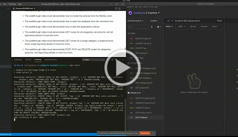

# E-Commerce Backend

## Description:

An e-commerce backend with models representing products, categories and tags which leverages an express server using sequelize to interact with a MySQL database in response to HTTP requests which modify persistent data through ORM.

## Table of Contents:

- [Walkthrough](#Walkthrough)
- [Installation](#installation)
- [Usage](#usage)
- [License](#license)
- [Contributing](#contributing)
- [Questions](#questions)

### Walkthrough

### Installation

Clone the repo then run this command within the repo directory:

`npm install`

Additionally, enter your credentials within the .env.EXAMPLE file and rename it to be simply `.env`

### Usage

Run `npm start` within the repo directory.

### License

This repository is licensed under the [MIT](https://opensource.org/licenses/MIT) license.

### Contributing

No contributions at this time.

### Questions

If you have any questions, head to my [GitHub](https://github.com/DandyCodes) or send me an email at jdabarker@gmail.com.
